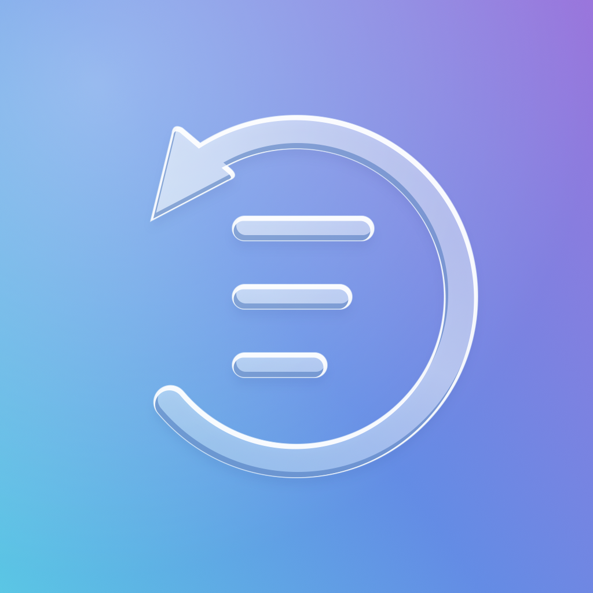

# Phone History

A small, on-device memory for your iPhone, with access for agents on a desktop you approve.



Phone History saves bounded changes in visible text, groups them into ten-minute activity memories using Apple's on-device model, and links each memory to its evidence. Pause or resume from the app or Control Center. A paired desktop can retrieve memories, inspect saved evidence, request a current accessibility read, or take a separately permitted screenshot through a local skill or MCP server.

**Developer prototype.** Capture has been exercised on a physical iPhone running iOS 26.6.2. It uses developer services, a local packet-tunnel extension, and one-time developer trust setup. This repository is source code, not an App Store release or a universally installable IPA. The guided setup is implemented; successful bootstrap on a new, previously unpaired device, broad compatibility and App Store eligibility are not verified.

## How it works

1. The embedded packet-tunnel worker connects to the phone's developer services using its own imported pairing record. After bootstrap, capture runs on the phone without a Mac, cloud relay or separate VPN app.
2. Temporary screen frames are processed by native Vision OCR every 10–30 seconds, with generic accessibility metadata and text fallback. Frames are discarded. There is no website-specific or app-specific parser.
3. Repeated text is deduplicated and changes are bounded to about 2 KiB per observation. Clock-only and routine interface text are filtered.
4. When the Apple system model is available, it writes a title and concise activity summary from bounded, line-numbered screen excerpts in one pass. Unverified process labels are excluded from its input. The prompt asks for concrete subjects, supported outcomes and uncertainty, without fixed activity wording. The model identifies support before composing its title and prose. It selects supporting lines; the app copies them verbatim and links them to their observations instead of taking each screen's opening text. Code validates references and size limits; accepted model prose is stored unchanged. Six-hour rollups resolve captured observations rather than reusing earlier AI prose as source truth. A rejected or abstaining generation creates no new memory. These checks do not establish semantic accuracy; quality replays remain a separate release check.
5. The same local store supplies the app and authenticated desktop reads. Desktop access is optional.

History is sampled and partial. It is **not** a tap/keystroke log or a complete accessibility tree. An inferred “You browsed…” memory describes likely activity from the sequence, not verified input events. Displayed text, OCR and generated summaries can be wrong. A page title does not prove watching, sending, buying or playing. Protected content and brief screens may be missed.

## Build

You need macOS, Xcode with the iOS 26.5+ SDK, Python 3.10+, a recent Rust toolchain supporting edition 2024, and an Apple developer account able to provision the app and extensions. Apple Intelligence memories also require a compatible phone and an available system model; capture can retain evidence without it.

```sh
git clone https://github.com/Panchangam18/phone-history.git
cd phone-history
cp phone-history-build.example.json .phone-history-build.json
# Edit team and unique identifiers in the ignored local config.
rustup target add aarch64-apple-ios
cargo build --locked --release --manifest-path Core/Cargo.toml --target aarch64-apple-ios
python3 make_background_project.py
open PhoneHistory.xcodeproj
```

Build the `PhoneHistory` scheme for your registered iPhone. The app and both extensions must share the configured App Group and have their required capabilities provisioned. Enable Developer Mode and trust your own Mac. Xcode generates signing profiles; none are bundled here.

Configuration can also come from `PHONE_HISTORY_TEAM`, `PHONE_HISTORY_BUNDLE_ID`, `PHONE_HISTORY_GROUP`, `PHONE_HISTORY_CONTROL_KIND`, `PHONE_HISTORY_BUILD` and `PHONE_HISTORY_VERSION`. The generated Xcode project, entitlements and Info plists are ignored. Unsigned source checks can use `CODE_SIGNING_ALLOWED=NO`; neutral defaults cannot provision a real device. Keep identifiers stable when updating an existing installation so its container and approvals remain accessible.

For distribution, set `encryption_export_code` (or `PHONE_HISTORY_ENCRYPTION_EXPORT_CODE`) only to the code Apple issued for your approved encryption documentation. This adds the non-exempt encryption declaration and approved code to the app's Info.plist. No approval or exemption is assumed when the field is empty; forked apps must resolve their own export compliance.

### One-time developer trust import

The app needs a remote developer-pairing record created for **that phone by its own trusted Mac**. Ordinary USB Lockdown pairing is a different record. Obtain the remote record using a compatible developer-service pairing client, such as [pymobiledevice3](https://github.com/doronz88/pymobiledevice3). Acquisition remains a developer step. The app now guides trust import, storage, VPN approval, capture readiness and optional desktop pairing; see [the setup guide](docs/SETUP.md).

The conversion helper validates a pymobiledevice3-style record and writes the native schema with owner-only permissions:

```sh
python3 -m venv Desktop/.venv
Desktop/.venv/bin/python -m pip install -r Desktop/requirements.txt
Desktop/.venv/bin/python tools/prepare_developer_trust.py --source /private/path/to/remote-record.plist --out /private/path/to/vpn-trial-pairing.plist
xcrun devicectl device copy to --device YOUR_DEVICE --domain-type appDataContainer --domain-identifier YOUR_BUNDLE_ID --source /private/path/to/vpn-trial-pairing.plist --destination Documents/vpn-trial-pairing.plist
```

Alternatively, transfer the converted file to your own phone and select it in the setup guide’s trust importer. Open Phone History after the USB bootstrap: it imports the file into its protected shared container and deletes the controlled Documents copy. Remove your temporary exported file yourself. Never send pairing records to another person or commit them. Tap Start capture and approve iOS's VPN configuration. The system VPN indicator remains; another packet-tunnel VPN cannot run alongside capture.

## Desktop agents

See [Desktop/README.md](Desktop/README.md) for phone approval, skill installation and MCP commands. Installing a skill does not grant access: the user approves the desktop's public-key fingerprint on the phone. Both devices need the same Wi-Fi and capture must be running. There is no automatic off-network access.

## Storage and performance

Settings offers no removal, a **512 KiB volume-based sliding window** by default, or transfer to an active approved desktop. Successful transfer removes only the acknowledged phone copy. Evidence and memories share the budget; old source references can expire. A 4 MiB daily writing ceiling provides an additional bound.

Capture adapts between 10 and 30 seconds and checks native memory headroom before expensive work. Status reports worker footprint and CPU counters. These exclude Apple's separate model service and are not a battery benchmark. Long-duration energy use, device diversity and uninterrupted background operation still need testing; there is no claim of negligible resource use on every phone.

## Verify

```sh
cargo test --locked --manifest-path Core/Cargo.toml --lib
Desktop/.venv/bin/python -m unittest discover -s tests -p 'test_*.py'
python3 -m unittest test_decode_history.py
```

The desktop suite compiles Swift fixtures on macOS and checks encrypted pairing, replay rejection, revocation, screenshot permissions, bounded exports, retention/offload and summary evidence checks. No personal history is used in fixtures. Passing build and protocol tests does not establish runtime coverage on a new device.

See [PRIVACY.md](PRIVACY.md), [SECURITY.md](SECURITY.md) and [CONTRIBUTING.md](CONTRIBUTING.md).

## License and acknowledgments

Phone History's original code is [MIT](LICENSE). **Its local packet transport uses code from [LocalDevVPN](https://github.com/jkcoxson/LocalDevVPN), by Stossy11 and the SideStore Team, under the [StosVPN License](ThirdParty/LocalDevVPN-LICENSE).** That license retains attribution and branding conditions; those parts are not relicensed under MIT.

The developer-service client uses [idevice](https://github.com/jkcoxson/idevice), by Jackson Coxson, under MIT. A patched source snapshot is vendored so builds do not depend on a private workspace. Versions and local changes are documented in [ThirdParty/README.md](ThirdParty/README.md). Other Cargo/Python dependencies retain their own licenses.

### Local model quality checks

Summary wording is entirely model-authored. `Shared/MemoryPrompts.swift` and the
model's guide descriptions control its style; no runtime verb mapping, sentence
substitution or activity-specific template rewrites the response. Source-reference
checks are structural and do not establish semantic correctness.

A Debug build accepts `--summary-replay` to evaluate explicit local fixtures from
`Documents/summary-replay/*-input.json`. Each fixture uses the desktop evidence
response shape (`entries` with `timestamp`, `text`, `id` and `source`). Results are
written beside it. This invokes the same `MemoryGeneration` function used by the
worker, makes no network request, and creates no history records. The replay
folder is excluded from backups. This diagnostic is excluded from Release builds;
use fictional fixtures for shared tests and keep personal replays private. Mac
model output alone is not an iPhone runtime check.
